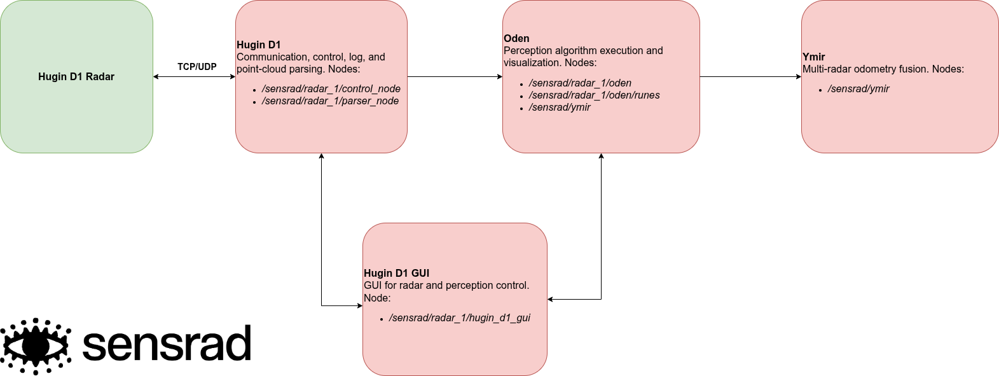

Copyright (c) Sensrad 2023-2025


# Sensrad ROS2 Software
This software package provides essential tools and interfaces for the effective operation of the Hugin radar system using ROS2.


## Quickstart with Docker
Sensrad offers a Docker container with all the necessary packages and tools to run the ROS2-based radar communication and perception software. This is the recommended way to quickly run and test the software, especially for new users.

The Docker image includes:

*   Pre-configured packages: ROS2 driver, perception library, radar control GUI, and configuration tool.
*   Consistent environment: Avoid compatibility issues.

For detailed instructions, refer to the [`README.md`](../launcher/README.md) file in the launcher folder. The guide covers Docker installation and running the container.

## ROS2 Packages
The Sensrad ROS2 software includes several packages, each designed to handle specific aspects of radar data processing and interaction. The system architecture, showing node and topic interactions, is illustrated below:




### hugin_d1
This package interfaces with the Hugin D1 radar and includes two nodes:
- **Control**:  Receives UDP point cloud packets and log status information from the radar. The node also manages radar control via TCP.
- **Parser**: Parses point clouds and publishes `PointCloud2` messages.

More details about the hugin_d1 package are available in this [`README.md`](ros2_ws/src/hugin_d1/README.md) file.

### hugin_d1_gui
A graphical user interface application for controlling the Hugin D1 radar. It offers basic functionalities such as:

- Start/stop radar operations.
- Synchronize time between ROS2 and radar time.
- Adjust radar parameters. Currently there is no option for setting radar range mode.

More details about the hugin_d1_gui package are available in this [`README.md`](ros2_ws/src/hugin_d1_gui/README.md) file.


### oden
Handles various perception tasks using radar data. Key features:

- Ego-motion estimation (3D velocity).

- Clustering of points from moving objects to create detections.

- Ground-plane estimation.

- Free space estimation.

- Implementation of local max filtering.

- Tracking and classification of dynamic objects.

More details about the oden package are available in the package readme [`README.md`](ros2_ws/src/oden/README.md) file.

### runes
A ROS2 node which subscribes to perception data from `oden` and publishes them in a standardized format which can be visualized in e.g. rviz2. More details about the runes package are available in this [`README.md`](ros2_ws/src/runes/README.md) file.

### ymir
A ROS2 node for aggregation of results from multiple radar. Currently only odometry data are processed_; where Ymir thus publishes a single unified odometry estimate.


## Environment Requirements
The software has been tested and verified on Ubuntu 24.04 x86-64 with ROS2 Jazzy Jalisco. Compatibility with other compute architectures or Linux distributions may require additional configuration or support.

For ROS2 installation, follow the [ROS2 Jazzy Jalisco Jalisco Installation Guide](https://docs.ros.org/en/jazzy/Installation/Ubuntu-Install-Debians.html).

Make sure to source the ROS2 environment:
```bash
source /opt/ros/jazzy/setup.bash
```

## Sensrad ROS2 Environment Setup
The current folder `ros2` of the Sensrad SDK can be used as ROS2 workspace.

### Dependencies
The Sensrad software depends on several external packages to function properly. They are stated in the `package.xml` of each ROS2 node.

Install the required dependencies by navigating into your ROS2 workspace and run
```bash
sudo apt update
rosdep update
rosdep install --from-paths src --ignore-src -r -y
```
Note that rosdep will install all missing and required packages using `sudo` command. It might report an error on  `raf2_interfaces` and `oden_interfaces` all part of the ROS2 workspace. This is reasonable since they are build separately and not installed through rosdep.

#### Additional ROS2 (non-standard packages)
- ros-jazzy-rviz2
- ros-jazzy-foxglove-bridge
- ros-jazzy-tf-transformations
- ros-jazzy-image-transport-plugins
- ros-jazzy-image-proc

#### MCAP Storage for Data Recording
- ros-jazzy-rosbag2-storage-mcap

You can install these dependencies using the following command:
```bash
sudo apt update && sudo apt install PACKAGE_NAME
```


## Build Sensrad ROS2 Software
1. Navigate into the ROS2 workspace folder
2. Build the packages:
```bash
colcon build
```
3. Source the built packages:
```bash
source install/setup.bash
```
4. To launch the radar nodes including perception and visualization, use the following command:
```bash
 ros2 launch yggdrasil sensrad.launch.py
```

## Configuration
Configuration settings for the Sensrad ROS2 environment are managed in the [`sensrad_params_1.yaml`](ros2_ws/src/yggdrasil/config/sensrad_params_1.yaml) file. This file allows the user to adjust various settings, including:

- **IP address of the Radar**: Update this if you are not using the default IP address.
- **Multiple radar setups**: Configure settings for operating multiple radars.
- **Visualizer settings**: Switch to different visualizers, such as foxglove-studio.


Note, to ensure that changes in the yaml-files are captured by the yggdrasil package, we recommend to add the flag `--symlink-install` when building the packages.

## Data Recording
To record data it is recommended to use the record functionality of the Hugin-D1 GUI.

## License
This project is licensed under the Sensrad Software License - see the [LICENSE](LICENSE.md) file for details.
